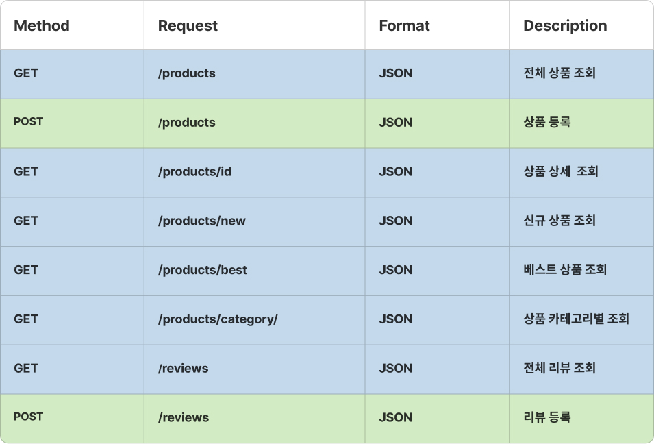

# 가구 쇼핑몰 프로젝트

    PWA 앱으로 제작한 풀스택 프로젝트입니다.
    프론트페이지는 React를 사용하여 제작하였습니다.
    벡앤드는 NodeJS의 Express프레임워크를 활용하여 서버를
    구현하였고 Sequelize 를 사용하여 데이터베이스도
    모델링하였습니다.

## 배포URL

[https://4niture-react.vercel.app/]

## 백엔드 서비스URL

[https://port-0-furnitureserver-nx562olfdt8jh2.sel3.cloudtype.app/]

## 백엔드 깃허브

[https://github.com/naehyun25/4niture_server.git]

## Stack

![Nodejs][node-image]&nbsp;&nbsp;&nbsp; ![Express][express-image] ![Sequelize][sequelize-image]

### Backs

    1. $ git clone https://github.com/naehyun25/4niture_server.git
    2. $ cd 4niture_server
    3. $ npm use v.16.19.0
    4. $ npm init
    5. $ npm i nodemon
    6. $ npm i multer
    7. $ npm i sequelize
    8. $ npm i sqlite3
    9. $ npm start

## 구현 목록

- MainPage
  - 각 섹션별 컴포넌트를 이용하여 구성.
  - 메인배너 SwiperSlide
  - 메인 New,Best 상품 데이터를 선별하여 출력.
- SubPage

  - 제품 상세 페이지
    데이터를 axios 사용하여 데이터베이스에서 불러오기.
    상품구매 탭 구현하여 구매시 수량감소 -> 품절처리.

  - 상품 업로드 페이지
    데이터베이스에 axios 사용하여 데이터베이스 추가하기.

  - 카테고리 페이지
    데이터 값중 일부를 추출하여 일치하는 것만 화면에 출력하기.

  - 리뷰, 리뷰업로드 페이지.
    리뷰를 업로드하면 리뷰 서버에 리뷰 등록.
    리뷰 데이터베이스를 불러와 리뷰 페이지를 구현.

 

## Data Type : JSON

    

[express-image]: https://img.shields.io/badge/express-000000?style=for-the-badge&logo=express&logoColor=white
[pwa-image]: https://img.shields.io/badge/pwa-6109AC?style=for-the-badge&logo=pwa&logoColor=white
[sequelize-image]: https://img.shields.io/badge/sequelize-52B0E7?style=for-the-badge&logo=sequelize&logoColor=white
[node-image]: https://img.shields.io/badge/node.js-339933?style=for-the-badge&logo=Node.js&logoColor=white
[npm-image]: https://img.shields.io/badge/npm-CB3837?style=for-the-badge&logo=npm&logoColor=white